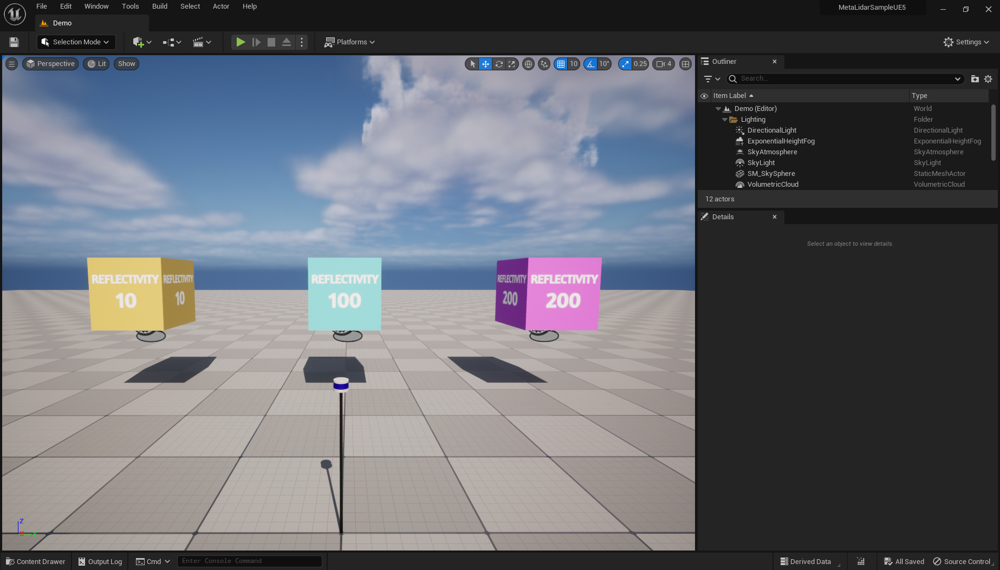

# MetaLidarSampleUE5
Sample project for testing 'MetaLidar' plugin.

## Prerequisite
This sample project is tesed under following condition:
- Ubutnu 22.04
- Intel i9-12900K
- NVIDIA RTX 3070
- RAM 32GB
- Unreal Engine 5.1.x

## Installation
First, you should install Unreal Engine 5. You can download pre-compiled UE5 for linux [here](https://www.unrealengine.com/en-US/linux). Set environment variable for UE5 root directory.
```
export UE5_ROOT=</path/to/ue5/root>
```
Clone this repo.
```
git clone https://github.com/metabotics-ai/MetaLidarSampleUE5.git
```
You should download *'MetaLidar'* and *'UDP-Uneal'* plugin for this sample project. You can simply import these plugin using *'metalidar.repos'* file via [vcstool](https://pypi.org/project/vcstool/) as below:
```
vcs import < metalidar.repos
```


You can now start the project by running the following command.
```
./update_project_files.sh
./make_editor.sh
./run_editor.sh
```
> Note: *'cleanup.sh'* is a convenient script for deleting project files.
> ```
> ./cleanup.sh
> ```

## Quick Start
We provide the 'Demo' level for a quick start, and when you start the project, you will see the following scene.



The 'Demo' devel includes following components.
- Velodyne VLP-16 3D LiDAR
- Cube boxes with reflectivity 10, 100, 200